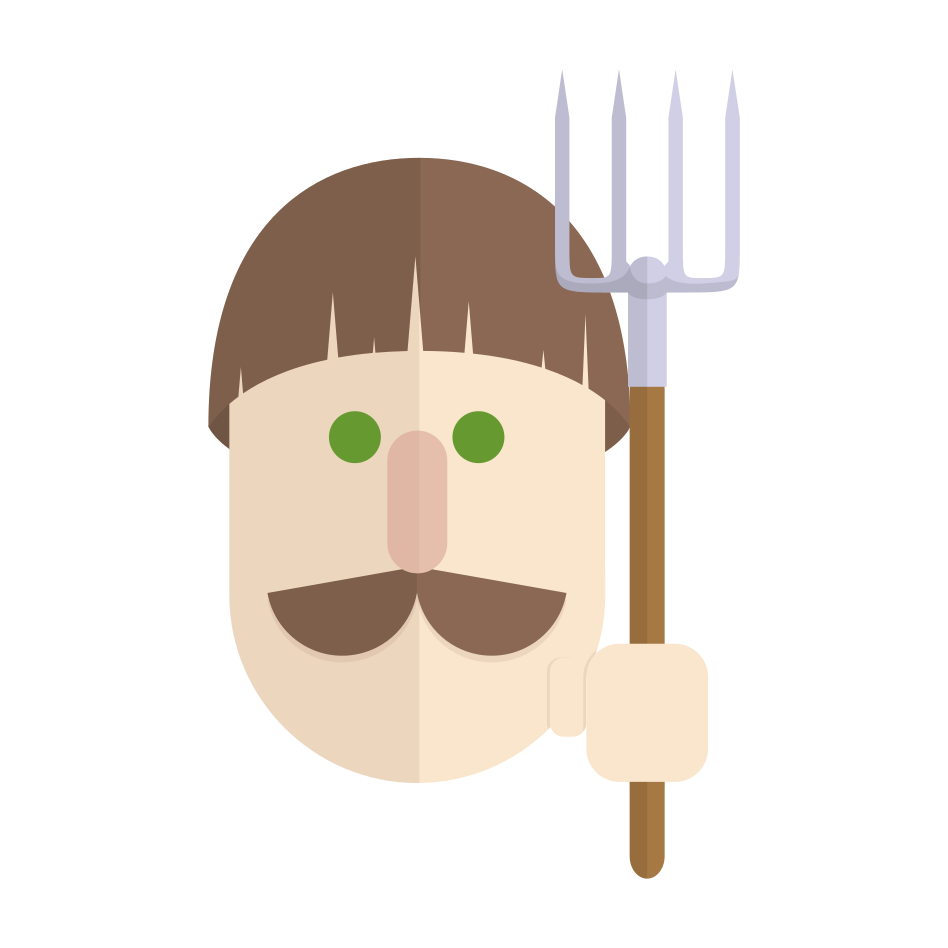
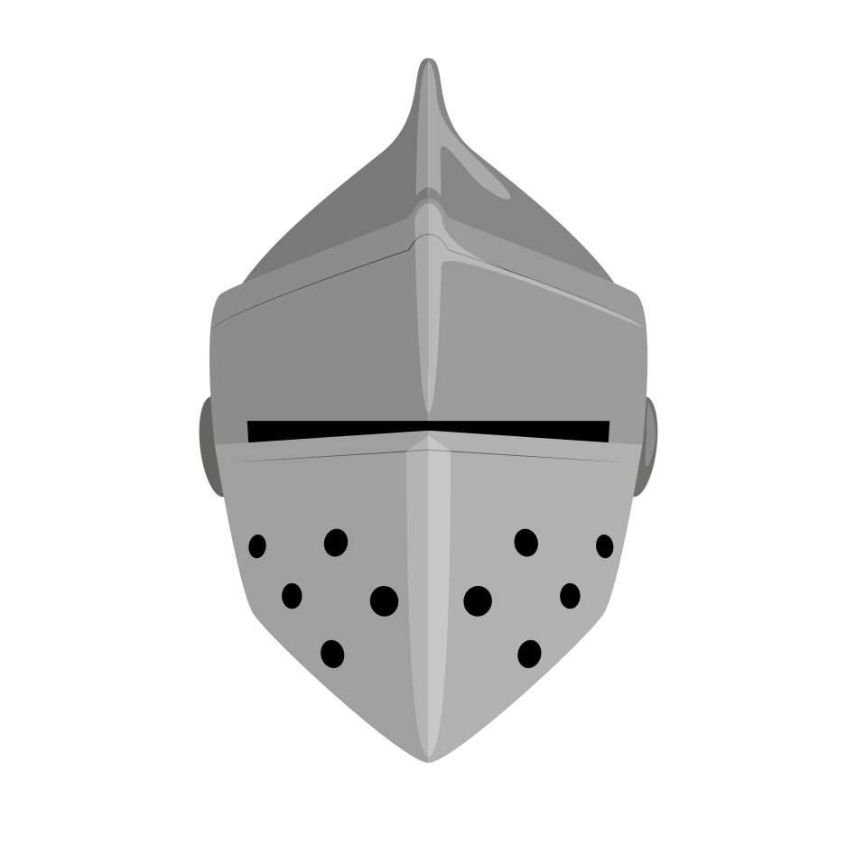
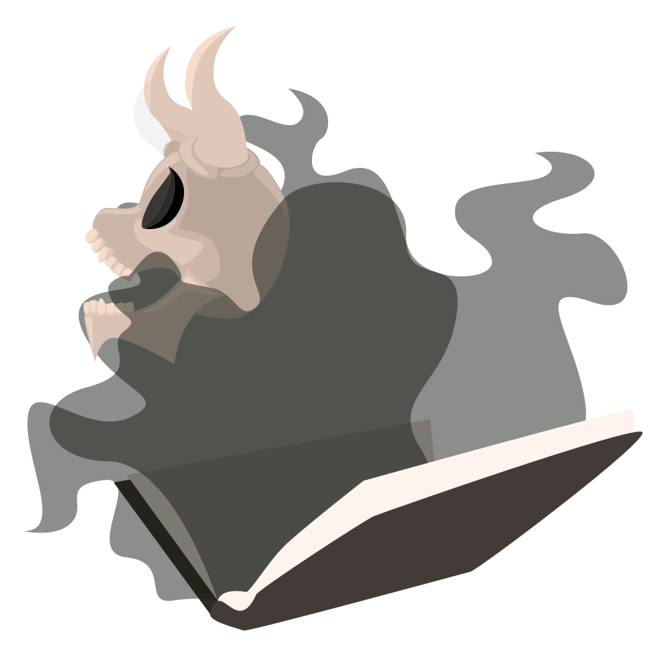
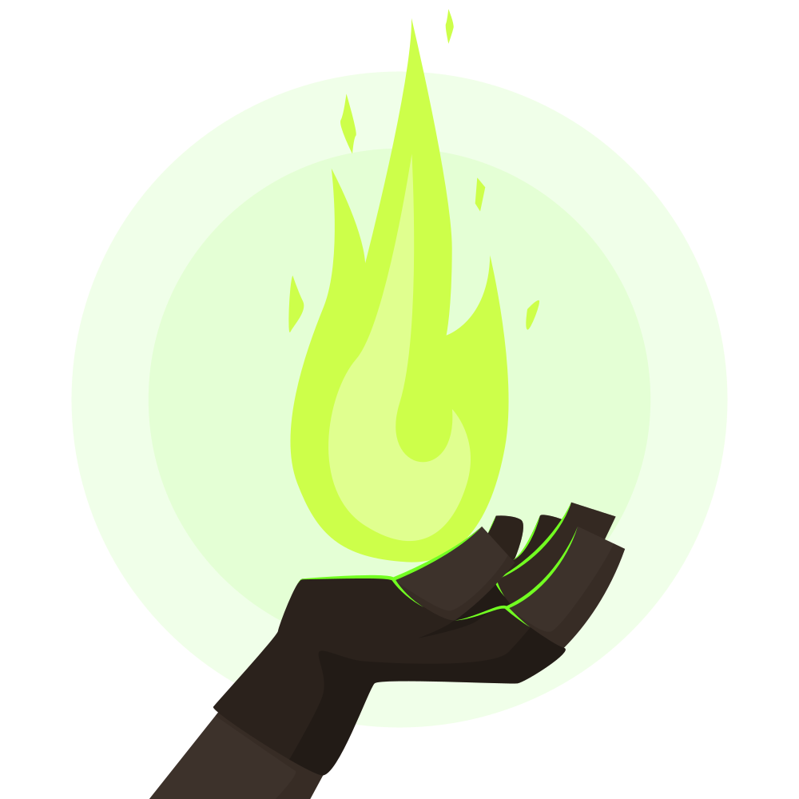
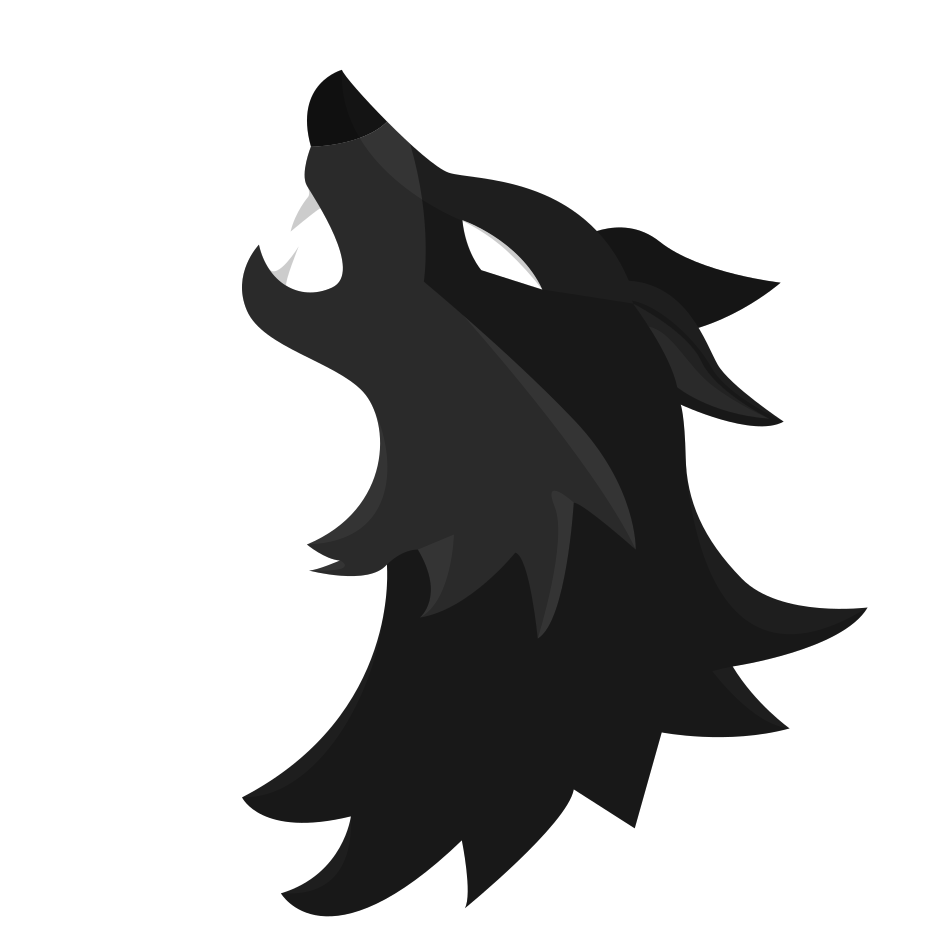

---
title:
- Wolfy.fr
theme:
- Copenhagen
---

# Villagers Camp

## Simple Villager

Defeating werewolves is his goal. His word is his only power of persuasion to eliminate them. Stay tuned for clues, and identify the culprits.

## Seer/Showy

Defeating werewolves is his goal. Each night she can know the role of a player she has chosen. She must help the villagers without being exposed.

## Witch

Defeating werewolves is his goal. She wakes up every night and can use one of two potions: healing the werewolf victim, or killing someone.

## Little girl

Defeating werewolves is his goal. She gets up at night when choosing werewolves to spy on their exchanges.

## Hunter

Defeating werewolves is his goal. Its role has a direct impact on the village. When the hunter dies he has the power to bring another player with him to his grave.

## Guard

Defeating werewolves is his goal. Each night, he can protect a different player from a werewolf attack.

## Cupid

Defeating werewolves is his goal. The first night, he designated two lovers. If one dies, the other will follow him to his grave.

## Mentalist

Defeating werewolves is his goal. He can perceive the outcome of each vote a little before its end.

## Necromancer

Defeating werewolves is his goal. At night, he can communicate with the dead, in order to obtain vital information ...

## Gravedigger

Defeating werewolves is his goal. When he dies, the gravedigger digs the grave of a player he chooses and a player of the opposite side. The names of these two players will be announced ...

## Dictator

Defeating werewolves is his goal. He can take the voting power of the village once in the game. If he executes a werewolf, he becomes mayor, if not, he dies.

## Red Riding Hood

Defeating werewolves is his goal. As long as the hunter is alive, she will be protected from attacks by werewolves.

## Pyromancer

Defeating werewolves is his goal. Each night, the pyromancer has the choice between storing a barrel of Greek fire with a player, or triggering their explosion.

# Werewolves Camp

## Simple Werewolf

Defeating the villagers is his goal. During the night werewolves meet to vote who will be eliminated. During the day it should not be exposed.

## Black Wolf

Defeating the villagers is his goal. During the night he wakes up with the other werewolves. Once in the game, he can change their victim into a werewolf.

## Talkative Wolf

Defeating the villagers is his goal. Every day, he receives a message telling him a word he must say before sunset, if he wants to stay alive.

# Solitary Protagonists

## White Wolf

Finishing alone as a survivor is his goal; he wakes up at night with the other werewolves who believe him to be an ally. Every other night, he can devour another player of his choice.

## Mercenary

On the first day, the objective of the mercenary is to eliminate the target assigned to him. If he succeeds, he immediately wins the game alone. Otherwise, he becomes a villager.

## Sick Rat

Finishing alone as a survivor is his goal. Each night, it can infect two players. He wins the game when all players are affected by the disease.

