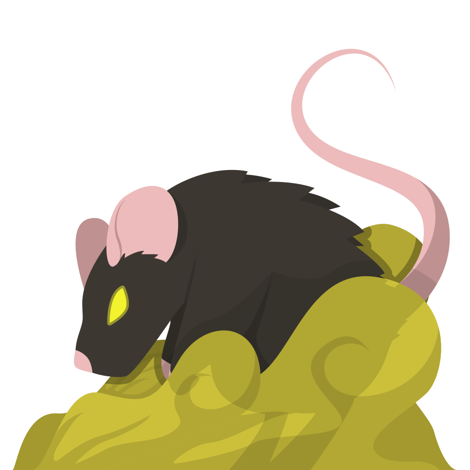

---
title:
- Wolfy.fr
theme:
- Copenhagen
---

# Camp des Villageois

## Simple Villageois

Vaincre les loups-garous est son objectif. Sa parole est son seul pouvoir de persuasion pour les éliminer. Restez à l'affût d'indice, et identifiez les coupables.

## Voyante

Vaincre les loups-garous est son objectif. Chaque nuit elle peut connaître le rôle d'un joueur qu'elle aura choisi. Elle doit aider les villageois sans se faire démasquer.

## Sorcière

Vaincre les loups-garous est son objectif. Elle se réveille chaque nuit et peut utiliser une de ses deux potions : soigner la victime des loups-garous, ou tuer quelqu’un.

## Petite Fille

Vaincre les loups-garous est son objectif. Elle se lève la nuit au moment du choix des loups-garous pour espionner leurs échanges.

## Chasseur

Vaincre les loups-garous est son objectif. Son rôle a un impact direct sur le village. Lorsque le chasseur meurt il a le pouvoir d'amener un autre joueur avec lui dans sa tombe.

## Garde

Vaincre les loups-garous est son objectif. Chaque nuit, il peut protéger un joueur différent contre une attaque des loups-garous.

## Cupidon

Vaincre les loups-garous est son objectif. La première nuit, il désigne deux amoureux. Si l'un meurt, l'autre le suivra dans sa tombe.

## Mentaliste

Vaincre les loups-garous est son objectif. Il peut percevoir l'issue de chaque vote un peu avant sa fin.

## Nécromancien

Vaincre les loups-garous est son objectif. La nuit, il peut communiquer avec les morts, afin d'en tirer des informations capitales...

## Fossoyeur

Vaincre les loups-garous est son objectif. À sa mort, le fossoyeur creuse la tombe d'un joueur qu'il choisit et d'un joueur du camp opposé. Les noms de ces deux joueurs seront annoncés...

## Dictateur

Vaincre les loups-garous est son objectif. Il peut s'emparer du pouvoir de vote du village une fois dans la partie. S'il exécute un loup-garou, il devient Maire, sinon, il meurt.

## Chaperon Rouge

Vaincre les loups-garous est son objectif. Tant que le chasseur est en vie, elle sera protégée contre les attaques des loups-garous.

## Pyromancien

Vaincre les loups-garous est son objectif. Chaque nuit, le pyromancien a le choix entre entreposer un tonneau de feu grégeois chez un joueur, ou déclencher leur explosion.

# Camp des Loups-Garous

## Simple Loup-Garou

Vaincre les villageois est son objectif. Durant la nuit les loups-garous se réunissent pour voter qui va être éliminé. Pendant la journée il ne doit pas être démasqué.

## Loup Noir

Vaincre les villageois est son objectif. Durant la nuit il se réveille avec les autres loups-garous. Une fois dans la partie, il pourra changer leur victime en loup-garou.

## Loup Bavard

Vaincre les villageois est son objectif. Chaque jour, il reçoit un message lui indiquant un mot qu'il doit prononcer avant le coucher du soleil, s'il veut rester en vie.

# Camp Solitaire

## Loup Blanc

Finir seul survivant est son objectif, il se réveille la nuit avec les autres loups-garous qui le croient allié. Une nuit sur deux, il peut dévorer un autre joueur de son choix.

## Mercenaire

Le premier jour, l'objectif du mercenaire est d'éliminer la cible qui lui est attribuée. S'il y parvient, il gagne seul la partie instantanément. Sinon, il devient villageois.

## Rat Malade

Finir seul survivant est son objectif. Chaque nuit, il peut contaminer deux joueurs. Il gagne la partie lorsque tous les joueurs sont atteints par la maladie.

